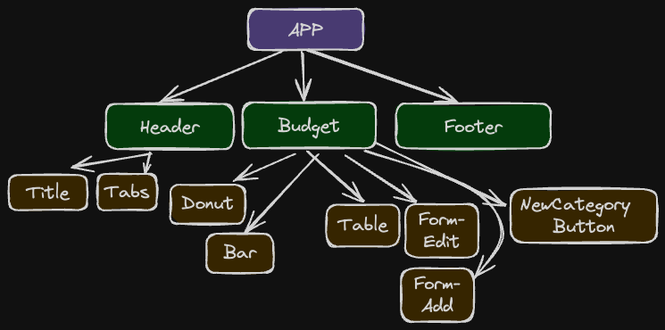
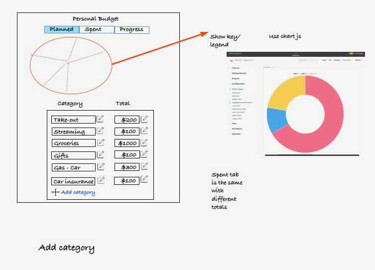
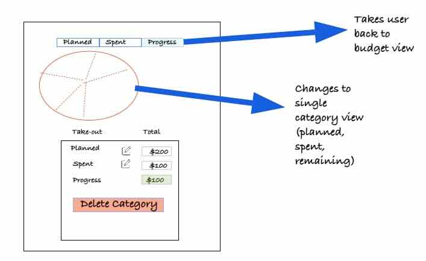
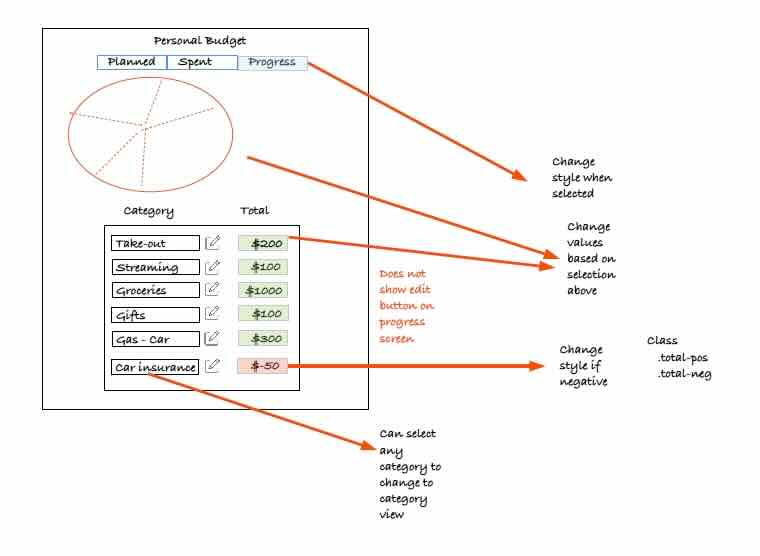
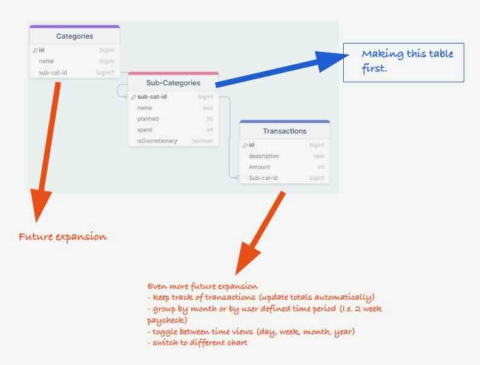
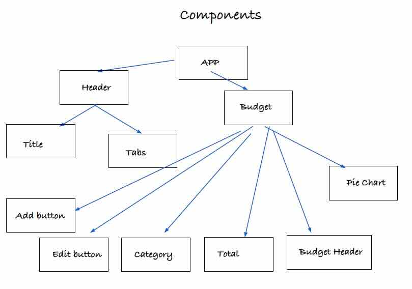

# MVP-React-Budget

Simple budget application with a useful and beautiful user interface including tables and charts to organize and display data.

## Table of Contents

- [Introduction](#introduction)
- [Features](#features)
- [Getting Started](#getting-started)
  - [Prerequisites](#prerequisites)
  - [Installation](#installation)
  - [Components](#components)
- [Usage](#usage)
- [API Endpoints](#api-endpoints)
- [Contributing](#contributing)
- [Acknowledgments](#acknowledgments)
- [Original Wire Diagram](#wire-diagrams)

## Introduction

This is a full stack REACT application with both front end and back end functionality and design. It is a simple budget application that displays user defined categories with planned and spent amounts in a useful way with HTTP routes for adding, editing, and deleting categories.

## Features

- A table to show categories. This can display different dollar amounts based on the tabs at the top of the app.
- Pie chart to show planned or spent dollar amounts.
- Bar chart to show overall budget progress.
- Dynamic forms for adding a category or editing existing categories.

## Getting Started

Project is run with node and vite locally.
https://github.com/MWise707/mvp-react-budget-tracker

### Prerequisites

- node
- express for server
- vite for development environment
- react
- install dependencies using npm init and npm install

### Installation

1. **Clone the repository:**

   ```zsh
   git clone https://github.com/MWise707/mvp-react-budget-tracker

   ```

2. **Navigate to the project directory.**
   ```zsh
   cd mvp-react-budget
   ```
3. **Install dependencies**
   ```zsh
   npm install
   ```

### Components



- App.jsx is the parent component for all others. It keeps track of state for categories (pulled from server through fetch and useEffect() hook), currentTab, and several other key variables through the useState() hook. These are passed down to other components through props.
- Header contains the title and tabs components. The tabs component could easily have gone into the Budget component as well but works fine in the Header. Current Tab is tracked at App level and changes are passed up through a call back function back to App to allow dynamic rendering of different charts and columns based on which tab is selected.
- Footer only contains some text. Both footer and header have similar styling to match and tie the application together.
- The budget is contains 6 child components. The top half of the budget component changes dynamically. The planned donut chart is rendered by default. If a different tab is selected it switches to a spent donut chart or to the progress table. If one of categories is selected at the table level then the edit form or add category form is shown instead of charts. This logic is handled at the Budget level.
- The Table element was started with a tutorial from Code Complete. URL listed in acknowledgements. I didn't add all of the functionality but this can be added later. I used event listeners onClick() to register and handle actions from the edit icons and delete icons.
- There are two forms which are very similar. If I went back and refactored I would try to use the same component for both but with logic to handle edit versus add categories. Both pass data back up to the budget component through call back functions.
- The new category button is a simple button that triggers the render for the NewCatForm.

## Usage

This project can be used as is for a simple budget application or can be expanded with more tables in the database to allow for lists of expenditures and more filtering of data.

## API Endpoints

The api endpoint is named /api/categories since the table in the database is named categories.

## Contributing

I used a template from Galvanize to get started with the vite configuration and a shell for the server.

## Acknowledgments

- I love the apex-react Charts library. It was very well documented and easy to customize for this project. https://apexcharts.com/react-chart-demos/pie-charts/
- Code Complete: Simple react table tutorial https://www.youtube.com/watch?v=MINQoCSBmds&t=781s
- Template from Galvanize & Danny Andrews for helping me troubleshoot: https://github.com/gSchool/mcsp-full-stack-react-template
- Kevin Goble: Thanks for being an awesome instructor and for being so patient with the react lifecycle https://projects.wojtekmaj.pl/react-lifecycle-methods-diagram/

## Wire-diagrams






